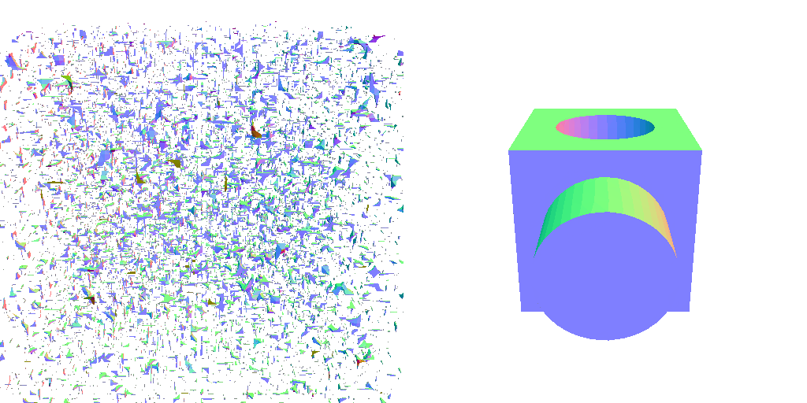
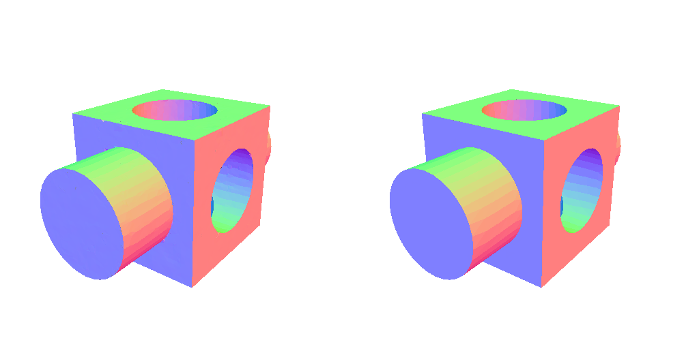
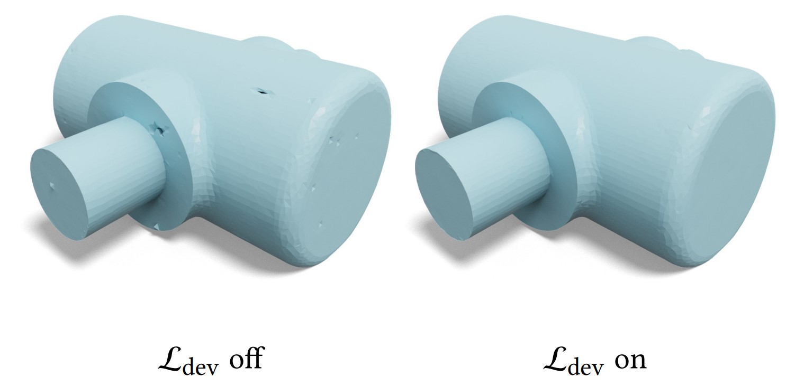

## Flexible Isosurface Extraction for Gradient-Based Mesh Optimization (FlexiCubes)<br><sub>Official PyTorch implementation </sub>


FlexiCubes is a high-quality isosurface representation specifically designed for gradient-based mesh optimization with respect to geometric, visual, or even physical objectives. For more details, please refer to our [paper](https://arxiv.org/abs/2308.05371) and [project page](https://research.nvidia.com/labs/toronto-ai/flexicubes/).

## Highlights
* [Getting started](https://github.com/nv-tlabs/FlexiCubes#getting-started)
* [Basic workflow](https://github.com/nv-tlabs/FlexiCubes#example-usage)
* [nvdiffrec: image-based reconstruction example](https://github.com/NVlabs/nvdiffrec#news)
* [GET3D: generative AI example](https://github.com/nv-tlabs/GET3D#employing-flexicubes)
* [Bibtex](https://github.com/nv-tlabs/FlexiCubes#citation)

## Getting Started

The core functions of FlexiCubes are now in [Kaolin](https://github.com/NVIDIAGameWorks/kaolin/) starting from v0.15.0. See installation instructions [here](https://kaolin.readthedocs.io/en/latest/notes/installation.html) and API documentations [here](https://kaolin.readthedocs.io/en/latest/modules/kaolin.non_commercial.html#kaolin.non_commercial.FlexiCubes)

The original code of the paper is still visible in `flexicube.py`.

## Example Usage

### Gradient-Based Mesh Optimization
We provide examples demonstrating how to use FlexiCubes for reconstructing unknown meshes through gradient-based optimization. Specifically, starting from randomly initialized SDF, we optimize the shape towards the reference mesh by minimizing their geometric difference, measured by multiview mask and depth losses. This workflow is a simplified version of `nvdiffrec` with code largely borrowed from the [nvdiffrec GitHub](https://github.com/NVlabs/nvdiffrec). We use the same pipeline to conduct the analysis in Section 3 and the main experiments described in Section 5 of our paper. We provide a detailed tutorial in `examples/optimization.ipynb`, along with an optimization script in `examples/optimize.py` which accepts command-line arguments.


To run the examples, it is suggested to install the Conda environment as detailed below:
```sh
conda create -n flexicubes python=3.9
conda activate flexicubes
conda install pytorch==1.12.0 torchvision==0.13.0 torchaudio==0.12.0 cudatoolkit=11.3 -c pytorch
pip install imageio trimesh tqdm matplotlib torch_scatter ninja
pip install git+https://github.com/NVlabs/nvdiffrast/
pip install kaolin==0.15.0 -f https://nvidia-kaolin.s3.us-east-2.amazonaws.com/torch-1.12.0_cu113.html
```

Then download the dataset collected by [Myles et al.](https://vcg.isti.cnr.it/Publications/2014/MPZ14/) as follows. We include one shape in 'examples/data/inputmodels/block.obj' if you want to test without downloading the full dataset.

```sh
cd examples
python download_data.py
```

After downloading the data, run shape optimization with the following example command:
```sh
python optimize.py --ref_mesh data/inputmodels/block.obj --out_dir out/block
```
You can find visualization and output meshes in the `out/block`. Below, we show the initial and final shapes during optimization, with the reference shape on the right.






To further demonstrate the flexibility of our FlexiCubes representation, which can accommodates both reconstruction objectives and regularizers defined on the extracted mesh, you can add a developability regularizer (proposed by [Stein et al.](https://www.cs.cmu.edu/~kmcrane/Projects/DiscreteDevelopable/)) to the previous reconstruction pipeline to encourage fabricability from panels:
```sh
python optimize.py --ref_mesh data/inputmodels/david.obj --out_dir out/david_dev --develop_reg True  --iter=1250
```

### Extract mesh from known signed distance field
While not its designated use case, our function can extract a mesh from a known Signed Distance Field (SDF) without optimization. Please refer to the tutorial found in `examples/extraction.ipynb` for details.

## Tips for using FlexiCubes
### Regularization losses: 
We commonly use three regularizers in our mesh optimization pipelines, referenced in lines `L104-L106` in `examples/optimize.py`. The weights of these regularizers should be scaled according to the your application objectives. Initially, it is suggested to employ low weights because strong regularization can hinder convergence. You can incrementally increase the weights if you notice artifacts appearing in the optimized meshes. Specifically:

* The loss function at `L104` helps to remove floaters in areas of the shape that are not supervised by the application objective, such as internal faces when using image supervision only.
* The L_dev loss at `L105` can be increased if you observe artifacts in flat areas, as illustrated in the image below.
* Generally, the L1 regularizer on flexible weights at `L106` does not have a significant impact during the optimization of a single shape. However, we found it to be effective in stabilizing training in generative pipelines such as GET3D.


### Resolution of voxel grid vs. tetrahedral grid:
If you are switching from our previous work, DMTet, it's important to note the difference in grid resolution when compared to FlexiCubes. In both implementations, the resolution is defined by the edge length: a grid resolution of `n` means the grid edge length is 1/n for both the voxel and tetrahedral grids. However, a tetrahedral grid with a resolution of `n` contains only `(n/2+1)³` grid vertices, in contrast to the `(n+1)³` vertices in a voxel grid. Consequently, if you are switching from DMTet to FlexiCubes while maintaining the same resolution, you will notice not only a denser output mesh but also a substantial increase in computational cost. To align the triangle count in the output meshes more closely, we recommend adopting a 4:5 resolution ratio between the voxel grid and the tetrahedral grid. For instance, in our paper, `64³` FlexiCubes generate approximately the same number of triangles as `80³` DMTet.

## Applications
FlexiCubes is now integrated into NVIDIA applications as a drop-in replacement for DMTet. You can visit their GitHub pages to see how FlexiCubes is used in advanced photogrammetry and 3D generative pipelines.

[Extracting Triangular 3D Models, Materials, and Lighting From Images (nvdiffrec)](https://github.com/NVlabs/nvdiffrec#news)

[GET3D: A Generative Model of High Quality 3D Textured Shapes Learned from Images](https://github.com/nv-tlabs/GET3D#employing-flexicubes)


## License
Copyright (c) 2023, NVIDIA CORPORATION & AFFILIATES. All rights reserved.

This work is made available under the [Nvidia Source Code License](LICENSE.txt).

For business inquiries, please visit our website and submit the form: [NVIDIA Research Licensing](https://www.nvidia.com/en-us/research/inquiries/).

## Citation
```bibtex
@article{shen2023flexicubes,
author = {Shen, Tianchang and Munkberg, Jacob and Hasselgren, Jon and Yin, Kangxue and Wang, Zian 
        and Chen, Wenzheng and Gojcic, Zan and Fidler, Sanja and Sharp, Nicholas and Gao, Jun},
title = {Flexible Isosurface Extraction for Gradient-Based Mesh Optimization},
year = {2023},
issue_date = {August 2023},
publisher = {Association for Computing Machinery},
address = {New York, NY, USA},
volume = {42},
number = {4},
issn = {0730-0301},
url = {https://doi.org/10.1145/3592430},
doi = {10.1145/3592430},
journal = {ACM Trans. Graph.},
month = {jul},
articleno = {37},
numpages = {16}
}
```
