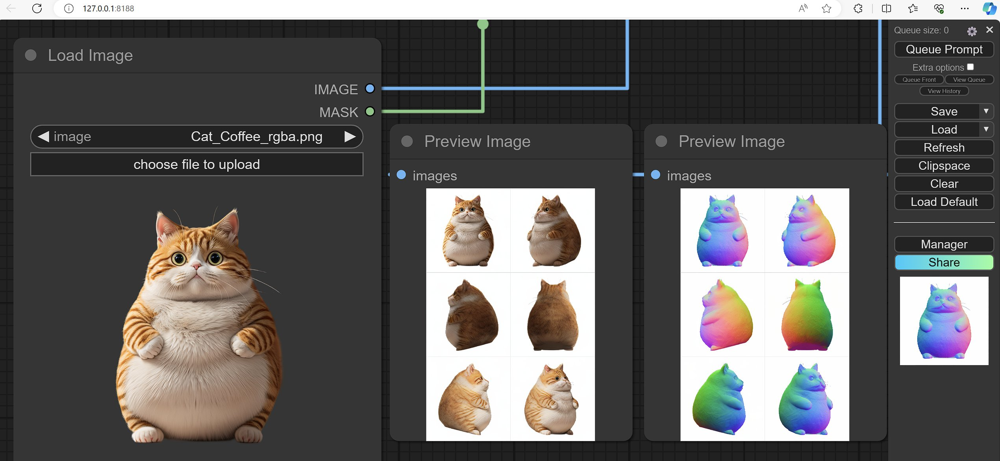
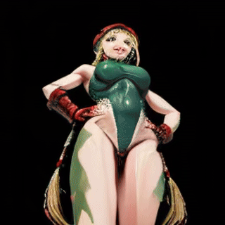

# ComfyUI-3D-Pack
**Make 3D assets generation in ComfyUI good and convenient as it generates image/video!**
<br>
This is an extensive node suite that enables ComfyUI to process 3D inputs (Mesh & UV Texture, etc.) using cutting edge algorithms (3DGS, NeRF, etc.) and models (InstantMesh, CRM, TripoSR, etc.)

<span style="font-size:1.5em;">
<a href=#Features>Features</a> &mdash;
<a href=#install>Install</a> &mdash;
<a href=#roadmap>Roadmap</a> &mdash;
<a href=#development>Development</a> &mdash;
<a href=#tips>Tips</a> &mdash;
<a href=#supporters>Supporters</a>
</span>

## Install:
**Can be installed directly from [ComfyUI-Manager](https://github.com/ltdrdata/ComfyUI-Manager)🚀**

**Alternatively you can download [Comfy3D-WinPortable](https://github.com/YanWenKun/Comfy3D-WinPortable) made by [YanWenKun](https://github.com/YanWenKun)**

- [Pre-builds](https://github.com/MrForExample/Comfy3D_Pre_Builds) are available for:
  - Windows 10/11
  - Python 3.12
  - CUDA 12.4
  - torch 2.5.1+cu124
- [install.py](install.py) will download & install Pre-builds automatically according to your runtime environment, if it couldn't find corresponding Pre-builds, then [build script](_Pre_Builds/_Build_Scripts/auto_build_all.py) will start automatically, if automatic build doesn't work for you, then please check out [Semi-Automatic Build Guide](_Pre_Builds/README.md#build-required-packages-semi-automatically)
- If you have any missing node in any open Comfy3D workflow, try simply click [Install Missing Custom Nodes](https://github.com/ltdrdata/ComfyUI-Manager?tab=readme-ov-file#support-of-missing-nodes-installation) in ComfyUI-Manager
- In case there is missing python library, you can check [all the python dependencies of my dev environment](my-reqs.txt)
- If for some reason your comfy3d can't download pre-trained models automatically, you can always download them manually and put them in to correct folder under [Checkpoints](Checkpoints)directory, but please **DON'T** overwrite any exist .json files
- Docker install please check [DOCKER_INSTRUCTIONS.md](DOCKER_INSTRUCTIONS.md)
- **Note:** at this moment, you'll still need to install [Visual Studio Build Tools for windows](_Pre_Builds/README.md#build-for-windows) and [install `gcc g++` for Linux](_Pre_Builds/README.md#build-for-linux) in order for `InstantNGP & Convert 3DGS to Mesh with NeRF and Marching_Cubes` nodes to work, since those two nodes used JIT torch cpp extension that builds in runtime, but I plan to replace those nodes

**For manual install**
```bash
# Fetch newest version of Comfy3D
cd Your ComfyUI Root Directory\ComfyUI\custom_nodes\
git clone https://github.com/MrForExample/ComfyUI-3D-Pack.git
cd ComfyUI-3D-Pack

# Install all dependencies
Your ComfyUI Root Directory\python_embeded\python.exe -s -m pip install -r requirements.txt
Your ComfyUI Root Directory\python_embeded\python.exe install.py
```


## Features:
- For use cases please check out [Example Workflows](./example_workflows/). [**Last update: 5/June/2025**]
  - **Note:** you need to put [Example Inputs Files & Folders](example_workflows/_Example_Inputs_Files/) under ComfyUI Root Directory\ComfyUI\input folder before you can run the example workflow
    
- **PartCrafter**: [wgsxm/PartCrafter](https://github.com/wgsxm/PartCrafter)  
  - Two-model pipeline:
    - **Single object** mode:
      - Single image → 3D mesh with **part segmentation**   
      - Output:
        - Merged full mesh
        - ZIP archive with individual part meshes
    - **Scene** mode:
      - Scene image → multiple 3D part meshes  
      - Output:
        - Merged full scene mesh
        - ZIP archive with individual object meshes
  - Model weights:
    - [PartCrafter (object mode)](https://huggingface.co/wgsxm/PartCrafter)  
    - [PartCrafter-Scene (scene mode)](https://huggingface.co/wgsxm/PartCrafter-Scene)
  - Workflows:
    - [Single Object](./example_workflows/PartCrafter/PartCrafter.json)  
    - [Scene](./example_workflows/PartCrafter/PartCrafter-Scene.json)
      
  <video controls autoplay loop src="https://github.com/user-attachments/assets/b80bcc97-7381-4cf7-9ec6-ee48c8d58217"></video>
  <video controls autoplay loop src="https://github.com/user-attachments/assets/d82f4b32-4916-4286-8478-a86dd5da37a6"></video>

- **Hunyuan3D_2.1**: [Tencent-Hunyuan/Hunyuan3D-2.1](https://github.com/Tencent-Hunyuan/Hunyuan3D-2.1)  
  - Updated two-stage pipeline:
    - Single image → 3D mesh (shape generation)
    - 3D mesh + reference image → 3D mesh with RGB texture
  - Model weights: https://huggingface.co/tencent/Hunyuan3D-2.1
  - Workflows: [Full](./example_workflows/Hunyuan3D_2_1/Hunyuan2.1-Full.json), [Shapegen](./example_workflows/Hunyuan3D_2_1/Hunyuan2.1-Shapegen.json), [Texgen](./example_workflows/Hunyuan3D_2_1/Hunyuan2.1-Texgen.json)

  <video controls autoplay loop src="https://github.com/user-attachments/assets/514bbece-ca19-43cf-83ca-2ccc6c60039e"></video>
  <video controls autoplay loop src="https://github.com/user-attachments/assets/65f329e7-610f-4520-b0c6-6da62f8209d1"></video>
  <video controls autoplay loop src="https://github.com/user-attachments/assets/b67a91f4-3d7f-4a2d-9202-c284b013e9fb"></video>

- **MV-Adapter**: [huanngzh/MV-Adapter](https://github.com/huanngzh/MV-Adapter)
  - Two generation methods:
    - IG2MV: Single image + 3D mesh to multi-view images
    - TG2MV: Text prompt + 3D mesh to multi-view images
    - Texturing: Grid image + 3D mesh to textured mesh
  - Model weights: https://huggingface.co/huanngzh/mv-adapter
  - Workflows: [IG2MV](./example_workflows/MV-Adapter/MV-Adapter-ig2mv.json), [T2MV](./example_workflows/MV-Adapter/MV-Adapter-tg2mv.json), [Texturing](./example_workflows/MV-Adapter/MV-Adapter-Texturing.json)
    
   <video controls autoplay loop src="https://github.com/user-attachments/assets/47b77c9e-a121-45c4-a6d0-f307bda1579c"></video>
   <video controls autoplay loop src="https://github.com/user-attachments/assets/35c6cee5-d408-4559-88aa-753741eacb95"></video>
   <video controls autoplay loop src="https://github.com/user-attachments/assets/dcf33c27-0ff7-4379-91b5-a0efe229d63c"></video>

- **Stable3DGen**: [Stable-X/Stable3DGen](https://github.com/Stable-X/Stable3DGen)
  - Two models pipeline:
    - Stable3DGen: Single image to 3D Mesh
    - StableNormal: Image processing for normal map generation
  - Model weights: 
    - Stable3DGen: https://huggingface.co/Stable-X/trellis-normal-v0-1
    - StableNormal: https://huggingface.co/Stable-X/yoso-normal-v1-8-1
  - [Workflow](./example_workflows/Stable3DGen.json)
    
  <video controls autoplay loop src="https://github.com/user-attachments/assets/2a38fa0a-4028-4fe5-a67a-bbc7c305da75"></video>
 
- **Hunyuan3D_V2**: turbo, mini, fast, multiview
  - Single image to 3D Mesh
  - Multi-views to 3D Mesh with RGB texture
  - Model weights: https://huggingface.co/tencent/Hunyuan3D-2, https://huggingface.co/tencent/Hunyuan3D-2mini
  - [Workflows](./example_workflows/Hunyuan3D_V2)
    
  <video controls autoplay loop src="https://github.com/user-attachments/assets/ae0f68d8-edd3-4bdd-9a9a-1f5ccc07a3d0"></video>

- **TripoSG**: [VAST-AI-Research/TripoSG](https://github.com/VAST-AI-Research/TripoSG)
  - Single image (Reference or Scribble) to 3D Mesh
  - Model weights: https://huggingface.co/VAST-AI/TripoSG, https://huggingface.co/VAST-AI/TripoSG-scribble

  <video controls autoplay loop src="https://github.com/user-attachments/assets/7b7969c1-e7c8-465b-9605-8bba7e847dbf"></video>

- **TRELLIS**: [microsoft/TRELLIS](https://github.com/microsoft/TRELLIS)
  - Single image to 3D Mesh with RGB texture
  - Model weights: https://huggingface.co/jetx/TRELLIS-image-large

  <video controls autoplay loop src="https://github.com/user-attachments/assets/f569c561-23ea-471f-a9d3-f2e6d1803e00"></video>

- **Hunyuan3D_V2** [tencent/Hunyuan3D-2](https://github.com/Tencent/Hunyuan3D-2/)
  - Two stages pipeline:
    1. Single image to 3D Mesh shape only
    2. 3D Mesh shape + Single reference image to 3D Mesh with RGB texture
  - Model weights: https://huggingface.co/tencent/Hunyuan3D-2/tree/main
  - [Workflows](https://github.com/DenisKochetov/ComfyUI-3D-Pack/tree/dev/example_workflows/Hunyuan3D_V2)

  <video controls autoplay loop src="https://github.com/user-attachments/assets/da6a8f8b-8dab-4460-90a6-44769ec9bb09"></video>

- **Hunyuan3D_V1** [tencent/Hunyuan3D-1](https://github.com/Tencent/Hunyuan3D-1/)
  - Two stages pipeline:
    1. Single image to multi-views
  	1. Multi-views to 3D Mesh with RGB texture
  - Model weights: https://huggingface.co/tencent/Hunyuan3D-1/tree/main

  <video controls autoplay loop src="https://github.com/user-attachments/assets/2cc31b81-2107-40fe-a531-a783a3f699fc"></video>

- **StableFast3D**: [Stability-AI/stable-fast-3d](https://github.com/Stability-AI/stable-fast-3d)
  - Single image to 3D Mesh with RGB texture
  - *Note: you need to agree to Stability-AI's term of usage before been able to download the model weights, if you downloaded model weights manually, then you need to put it under [Checkpoints/StableFast3D](Checkpoints/StableFast3D), otherwise you can add your huggingface token in [Configs/system.conf](Configs/system.conf)*
  - Model weights: https://huggingface.co/stabilityai/stable-fast-3d/tree/main

  <video controls autoplay loop src="https://github.com/user-attachments/assets/3ed3d1ed-4abe-4959-bd79-4431d19c9d47"></video>

- **CharacterGen**: [zjp-shadow/CharacterGen](https://github.com/zjp-shadow/CharacterGen)
  - Single front view of a character with arbitrary pose
  - Can [combine with Unique3D workflow](./example_workflows/CharacterGen/CharacterGen_to_Unique3D.json) for better result
  - Model weights: https://huggingface.co/zjpshadow/CharacterGen/tree/main
 
  <video controls autoplay loop src="https://github.com/user-attachments/assets/4f0ae0c0-2d29-49f0-a6f2-a636dd4b4dcc"></video>

- **Unique3D**: [AiuniAI/Unique3D](https://github.com/AiuniAI/Unique3D)
  - Four stages pipeline: 
    1. Single image to 4 multi-view images with resolution: 256X256
    2. Consistent Multi-view images Upscale to 512X512, super resolution to 2048X2048
    3. Multi-view images to Normal maps with resolution: 512X512, super resolution to 2048X2048
    4. Multi-view images & Normal maps to 3D mesh with texture
  - To use the [All stage Unique3D workflow](./example_workflows/Unique3D/Unique3D_All_Stages.json), Download Models:
    - [sdv1.5-pruned-emaonly](https://huggingface.co/runwayml/stable-diffusion-v1-5/blob/main/v1-5-pruned-emaonly.ckpt) and put it into `Your ComfyUI root directory/ComfyUI/models/checkpoints`
    - [fine-tuned controlnet-tile](https://huggingface.co/spaces/Wuvin/Unique3D/tree/main/ckpt/controlnet-tile) and put it into `Your ComfyUI root directory/ComfyUI/models/controlnet`
    - [ip-adapter_sd15](https://huggingface.co/h94/IP-Adapter/blob/main/models/ip-adapter_sd15.safetensors) and put it into `Your ComfyUI root directory/ComfyUI/models/ipadapter`
    - [OpenCLIP-ViT-H-14](https://huggingface.co/h94/IP-Adapter/blob/main/models/image_encoder/model.safetensors), rename it to **OpenCLIP-ViT-H-14.safetensors** and put it into `Your ComfyUI root directory/ComfyUI/models/clip_vision`
    - [RealESRGAN_x4plus](https://github.com/xinntao/Real-ESRGAN/releases/download/v0.1.0/RealESRGAN_x4plus.pth) and put it into `Your ComfyUI root directory/ComfyUI/models/upscale_models`
  - Model weights: https://huggingface.co/spaces/Wuvin/Unique3D/tree/main/ckpt

  <video controls autoplay loop src="https://github.com/MrForExample/ComfyUI-3D-Pack/assets/62230687/45dd6bfc-4f2b-4b1f-baed-13a1b0722896"></video>

- **Era3D MVDiffusion Model**: [pengHTYX/Era3D](https://github.com/pengHTYX/Era3D)
  - Single image to 6 multi-view images & normal maps with resolution: 512X512
  - *Note: you need at least 16GB vram to run this model*
  - Model weights: https://huggingface.co/pengHTYX/MacLab-Era3D-512-6view/tree/main

  <video controls autoplay loop src="https://github.com/MrForExample/ComfyUI-3D-Pack/assets/62230687/fc210cac-6c7d-4a55-926c-adb5fb7b0c57"></video>

- **InstantMesh Reconstruction Model**: [TencentARC/InstantMesh](https://github.com/TencentARC/InstantMesh)
  - Sparse multi-view images with white background to 3D Mesh with RGB texture
  - Works with arbitrary MVDiffusion models (Probably works best with Zero123++, but also works with CRM MVDiffusion model)
  - Model weights: https://huggingface.co/TencentARC/InstantMesh/tree/main

  <video controls autoplay loop src="https://github.com/MrForExample/ComfyUI-3D-Pack/assets/62230687/a0648a44-f8cb-4f78-9704-a907f9174936"></video>
  <video controls autoplay loop src="https://github.com/MrForExample/ComfyUI-3D-Pack/assets/62230687/33aecedb-f595-4c12-90dd-89d5f718598e"></video>


- **Zero123++**: [SUDO-AI-3D/zero123plus](https://github.com/SUDO-AI-3D/zero123plus)
  - Single image to 6 view images with resolution: 320X320

- **Convolutional Reconstruction Model**: [thu-ml/CRM](https://github.com/thu-ml/CRM)
  - Three stages pipeline: 
    1. Single image to 6 view images (Front, Back, Left, Right, Top & Down)
    2. Single image & 6 view images to 6 same views CCMs (Canonical Coordinate Maps)
    3. 6 view images & CCMs to 3D mesh
  - *Note: For low vram pc, if you can't fit all three models for each stages into your GPU memory, then you can divide those three stages into different comfy workflow and run them separately*
  - Model weights: https://huggingface.co/sudo-ai/zero123plus-v1.2

  <video controls autoplay loop src="https://github.com/MrForExample/ComfyUI-3D-Pack/assets/62230687/cf68bb83-9244-44df-9db8-f80eb3fdc29e"></video>

- **TripoSR**: [VAST-AI-Research/TripoSR](https://github.com/VAST-AI-Research/TripoSR) | [ComfyUI-Flowty-TripoSR](https://github.com/flowtyone/ComfyUI-Flowty-TripoSR)
  - Generate NeRF representation and using marching cube to turn it into 3D mesh
  - Model weights: https://huggingface.co/stabilityai/TripoSR/tree/main
  - [tripoSR-layered-diffusion workflow](https://github.com/C0nsumption/Consume-ComfyUI-Workflows/tree/main/assets/tripo_sr/00) by [@Consumption](https://twitter.com/c0nsumption_)
 
  <video controls autoplay loop src="https://github.com/MrForExample/ComfyUI-3D-Pack/assets/62230687/ec4f8df5-5907-4bbf-ba19-c0565fe95a97"></video>

- **Wonder3D**: [xxlong0/Wonder3D](https://github.com/xxlong0/Wonder3D)
  - Generate spatial consistent 6 views images & normal maps from a single image
  - Model weights: https://huggingface.co/flamehaze1115/wonder3d-v1.0/tree/main
  
  

- **Large Multiview Gaussian Model**: [3DTopia/LGM](https://github.com/3DTopia/LGM)
  - Enable single image to 3D Gaussian in less than 30 seconds on a RTX3080 GPU, later you can also convert 3D Gaussian to mesh
  - Model weights: https://huggingface.co/ashawkey/LGM/tree/main

  <video controls autoplay loop src="https://github.com/MrForExample/ComfyUI-3D-Pack/assets/62230687/e221d7f8-49ac-4ed4-809b-d4c790b6270e"></video>

- **Triplane Gaussian Transformers**: [VAST-AI-Research/TriplaneGaussian](https://github.com/VAST-AI-Research/TriplaneGaussian)
  - Enable single image to 3D Gaussian in less than 10 seconds on a RTX3080 GPU, later you can also convert 3D Gaussian to mesh
  - Model weights: https://huggingface.co/VAST-AI/TriplaneGaussian/tree/main

  <video controls autoplay loop src="https://github.com/MrForExample/ComfyUI-3D-Pack/assets/62230687/90e7f298-bdbd-4c15-9378-1ca46cbb4871"></video>

- **Preview 3DGS and 3D Mesh**: 3D Visualization inside ComfyUI:
  - Using [gsplat.js](https://github.com/huggingface/gsplat.js/tree/main) and [three.js](https://github.com/mrdoob/three.js/tree/dev) for 3DGS & 3D Mesh visualization respectively
  - Custumizable background base on JS library: [mdbassit/Coloris](https://github.com/mdbassit/Coloris)

  <video controls autoplay loop src="https://github.com/MrForExample/ComfyUI-3D-Pack/assets/62230687/9f3c56b1-afb3-4bf1-8845-ab1025a87463"></video>

- **Stack Orbit Camera Poses**: Automatically generate all range of camera pose combinations
  - You can use it to conditioning the [StableZero123 (You need to Download the checkpoint first)](https://comfyanonymous.github.io/ComfyUI_examples/3d/), with full range of camera poses in one prompt pass
  - You can use it to generate the orbit camera poses and directly input to other 3D process node (e.g. GaussianSplatting and BakeTextureToMesh)
  - Example usage:

     
    <br>
      
  - Coordinate system:
    - Azimuth: In top view, from angle 0 rotate 360 degree with step -90 you get (0, -90, -180/180, 90, 0), in this case camera rotates clock-wise, vice versa.
    - Elevation: 0 when camera points horizontally forward, pointing down to the ground is negitive angle, vice versa.

- **FlexiCubes**: [nv-tlabs/FlexiCubes](https://github.com/nv-tlabs/FlexiCubes)
  - Multi-View depth & mask (optional normal maps) as inputs
  - Export to 3D Mesh
  - Usage guide: 
    - *voxel_grids_resolution*: determine mesh resolution/quality
    - *depth_min_distance* *depth_max_distance* : distance from object to camera, object parts in the render that is closer(futher) to camera than depth_min_distance(depth_max_distance) will be rendered with pure white(black) RGB value 1, 1, 1(0, 0, 0)
    - *mask_loss_weight*: Control the silhouette of reconstrocted 3D mesh
    - *depth_loss_weight*: Control the shape of reconstrocted 3D mesh, this loss will also affect the mesh deform detail on the surface, so results depends on quality of the depth map
    - *normal_loss_weight*: Optional. Use to refine the mesh deform detail on the surface
    - *sdf_regularizer_weight*: Helps to remove floaters in areas of the shape that are not supervised by the application objective, such as internal faces when using image supervision only
    - *remove_floaters_weight*: This can be increased if you observe artifacts in flat areas
    - *cube_stabilizer_weight*: This does not have a significant impact during the optimization of a single shape, however it helps to stabilizing training in somecases

  <video controls autoplay loop src="https://github.com/MrForExample/ComfyUI-3D-Pack/assets/62230687/166bbc1f-04b7-42c8-87bb-302e3f5aabb2"></video>


- **Instant NGP**: [nerfacc](https://github.com/nerfstudio-project/nerfacc)
  - Multi-View images as inputs
  - Export to 3D Mesh using marching cubes

- **3D Gaussian Splatting**
  - [Improved Differential Gaussian Rasterization](https://github.com/ashawkey/diff-gaussian-rasterization)
  - Better Compactness-based Densification method from [Gsgen](https://gsgen3d.github.io/), 
  - Support initialize gaussians from given 3D mesh (Optional)
  - Support mini-batch optimazation
  - Multi-View images as inputs
  - Export to standard 3DGS .ply format supported
  
- **Gaussian Splatting Orbit Renderer**
  - Render 3DGS to images sequences or video, given a 3DGS file and camera poses generated by **Stack Orbit Camera Poses** node
  
- **Mesh Orbit Renderer**
  - Render 3D mesh to images sequences or video, given a mesh file and camera poses generated by **Stack Orbit Camera Poses** node

- **Fitting_Mesh_With_Multiview_Images**
  - Bake Multi-View images into UVTexture of given 3D mesh using [Nvdiffrast](https://github.com/NVlabs/nvdiffrast), supports:
  - Export to .obj, .ply, .glb

- **Save & Load 3D file**
  - .obj, .ply, .glb for 3D Mesh
  - .ply for 3DGS

- **Switch Axis for 3DGS & 3D Mesh**
  - Since different algorithms likely use different coordinate system, so the ability to re-mapping the axis of coordinate is crucial for passing generated result between differnt nodes.

- **[Customizable system config file](Configs/system.conf)**
  - Custom clients IP address
  - Add your huggingface user token

## Roadmap:
- [X] Integrate [CharacterGen](https://github.com/zjp-shadow/CharacterGen)

- [ ] Improve 3DGS/Nerf to Mesh conversion algorithms:
  -  Find better methods to converts 3DGS or Points Cloud to Mesh (Normal maps reconstruction maybe?)

- [ ] Add & Improve a few best MVS algorithms (e.g 2DGS, etc.)

- [ ] Add camera pose estimation from raw multi-views images

## Development
#### How to Contribute
1. Fork the project
2. Make Improvements/Add New Features
3. Creating a Pull Request to [dev branch](https://github.com/MrForExample/ComfyUI-3D-Pack/tree/dev)

#### Project Structure 
- **[nodes.py](nodes.py)**: 
<br>Contains the interface code for all Comfy3D nodes (i.e. the nodes you can actually seen & use inside ComfyUI), you can add your new nodes here

- **[Gen_3D_Modules](Gen_3D_Modules)**:
<br>A folder that contains the code for all generative models/systems (e.g. multi-view diffusion models, 3D reconstruction models). New 3D generative modules should be added here

- **[MVs_Algorithms](MVs_Algorithms)**:
<br>A folder that contains the code for all multi-view stereo algorithms, i.e. algorighms (e.g. Gaussian Splatting, NeRF and FlexiCubes) that takes multi-view images and convert it to 3D representation (e.g. Gaussians, MLP or Mesh). New MVS algorithms should be added here

- **[web](web)**:
<br>A folder that contains the files & code (html, js, css) for all browser UI related things (e.g. the html layout, style and the core logics for preview 3D Mesh & Gaussians). New web UI should be added here

- **[webserver](webserver)**:
<br>A folder that contains the code for communicate with browser, i.e. deal with web client requests (e.g. Sending 3D Mesh to client when requested with certain url routes). New web server related functions should be added here

- **[Configs](Configs)**:
<br>A folder that contains different config files for different modules, new config should be added here, use a sub folder if there are more than one config to a single module (e.g. [Unique3D](Configs/Unique3D_configs), [CRM](Configs/CRM_configs))

- **[Checkpoints](Checkpoints)**:
<br>A folder that contains all the pre-trained model and some of the model architecture config files required by diffusers, New checkpoints if could be downloaded automatically by `Load_Diffusers Pipeline` node, then it should be added here

- **[install.py](install.py)**: 
<br>Main install script, will download & install [Pre-builds](https://github.com/MrForExample/Comfy3D_Pre_Builds) automatically according to your runtime environment, if it couldn't find corresponding Pre-builds, then [build script](_Pre_Builds/_Build_Scripts/auto_build_all.py) will start automatically, called by ComfyUI-Manager right after it installed the dependencies listed in [requirements.txt](requirements.txt) using pip
<br>If the new modules your are trying to add needs some additional packages that cannot be simplly added into [requirements.txt](requirements.txt) and [build_config.remote_packages](_Pre_Builds/_Build_Scripts/build_config.yaml), then you can try to add it by modify this script

- **[_Pre_Builds](_Pre_Builds)**:
<br>A folder that contains the files & code for build all required dependencies, if you want to pre-build some additional dependencies, then please check [_Pre_Builds/README.md](_Pre_Builds/README.md) for more informations

## Tips
* OpenGL (Three.js, Blender) world & camera coordinate system:
  ```
      World            Camera        
    
      +y              up  target                                              
      |                |  /                                           
      |                | /                                           
      |______+x        |/______right                                      
      /                /         
     /                /          
    /                /           
  +z               forward           

  z-axis is pointing towards you and is coming out of the screen
  elevation: in (-90, 90), from +y to +x is (-90, 0)
  azimuth: in (-180, 180), from +z to +x is (0, 90)
  ```
* If you encounter OpenGL errors (e.g., `[F glutil.cpp:338] eglInitialize() failed`), then set `force_cuda_rasterize` to true on corresponding node
* If after the installation, your ComfyUI gets stuck at starting or running, you can follow the instructions in the following link to solve the problem: [Code Hangs Indefinitely When Evaluating Neuron Models on GPU](https://github.com/lava-nc/lava-dl/discussions/211)
* [Fix "nvcc fatal : Could not set up the environment for Microsoft Visual Studio using 'C:/Program Files (x86)/Microsoft V isual Studio/.../vcvars64.bat'](https://github.com/NVlabs/instant-ngp/issues/709#issuecomment-1378155274)
## Supporters
- [MrNeRF](https://twitter.com/janusch_patas)
